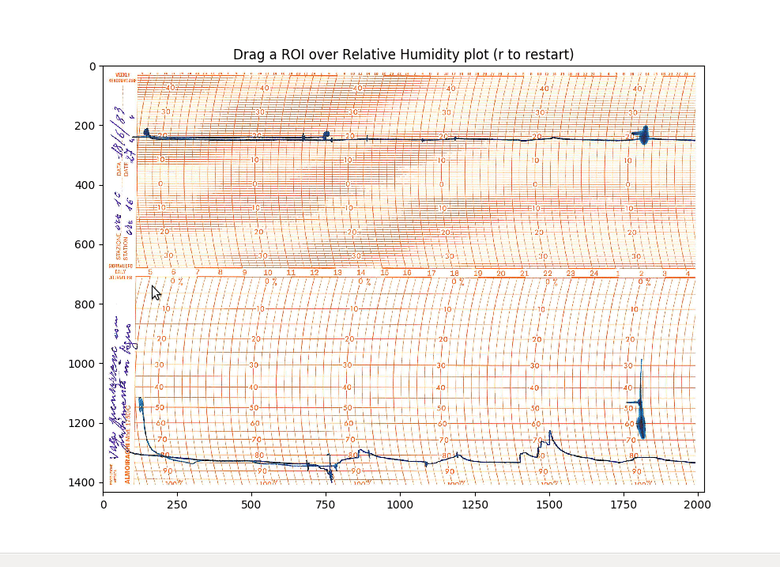
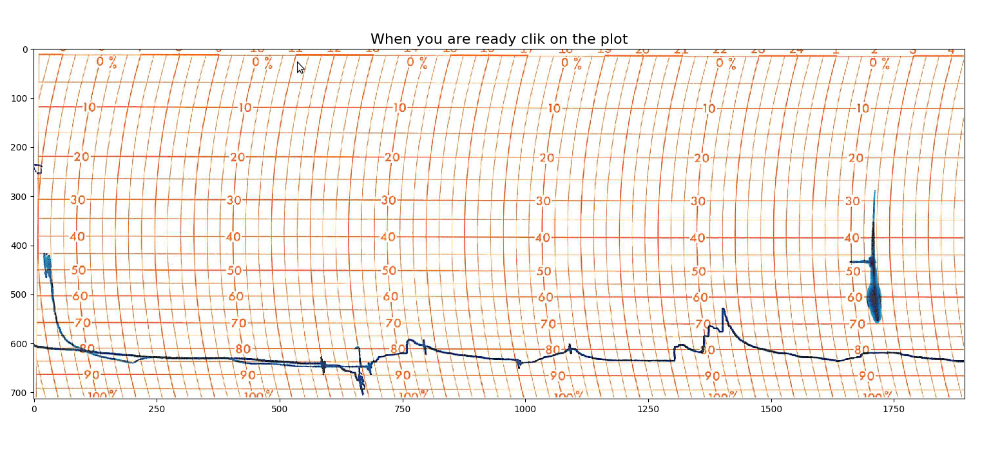

# Fogliodiagrammale
Fogliodiagrammale is a Python library for digitizing charts from drum hygrographs and thermo-hygrographs. The sheets must be scanned and imported as images. Different procedures can be used for identify the path and extracting the values. 

# Installation 
If you are new to Python the easiest way to get started is to use a distribution like [Anaconda](https://www.anaconda.com/). Then you can use the terminal to install the module using pip:

    pip install git+https://github.com/giacomomarchioro/fogliodiagrammale

# Tutorial
The workflow can be adapted depending on the input data. For analyzing the data  coming from different instruments and annotated using different conventions.
The first step is to extract the region with the meaningfoul information. If the scans are perfectly aligned this step can be done once for all the charts.

The second step consists in correcting the distortion due to the cantilever motion, finding the reference system and eventually extracting the coordinates of the trend.
If the charts have a single path for cycle this step can be almost always be performed automatically. Otherwise a series of control points must be places in order following the recording of the measruments.

The control points are then interpolated using a linear interpolation so they can be place only when the trend change drastically if the changes are gradual few control points ar needed.

